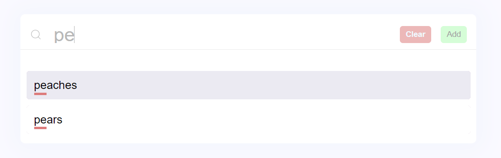
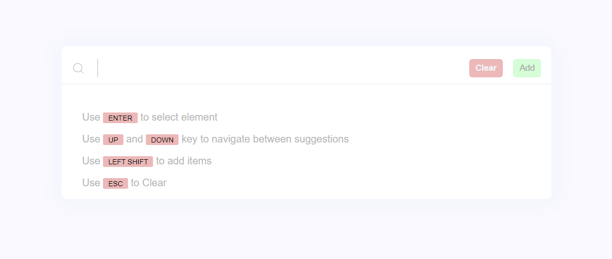
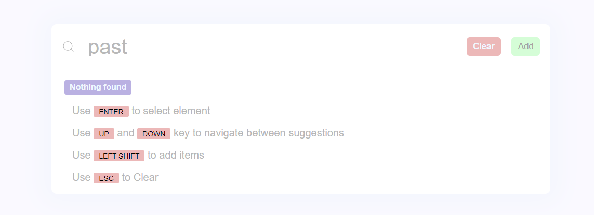

# zenatrix task search bar componenet

### Objective 
Create a search bar component using react.

### Requirements

- Should be able to _search_ through an array of strings
- Should be able to _add_ a new item to the array 

### Feature
- Mobile **responsive**
- **Highlighting** the matching search string in the suggestions


### Live link (Deployed in github pages)

[https://rishabhverma098.github.io/zenatrixTask/](https://rishabhverma098.github.io/zenatrixTask/)

### Screenshots




## Usage
- Use `ENTER` or **TAP** (for mobile) to select the suggested suggestion from the list.
- Use `UP` and `DOWN` keys to navigate between the suggestion list.
- Use `LEFT SHIFT` or _press **ADD** button_ to add user input in the suggestion list.
- Use `ESC` or _press **CLEAR** button_ to clear the text input field.

#### Run locally
```node
npm install
npm start
```
